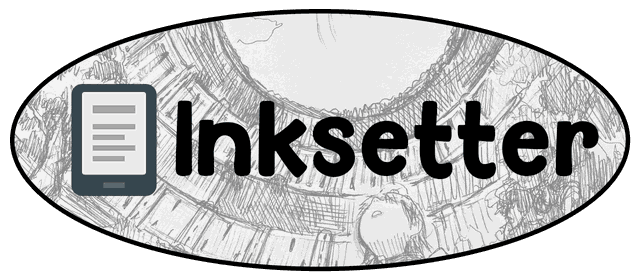

  <picture>
    
  </picture>

---

**Inksetter** is a proxy that sits between the OPDS server and the client running on an E-Ink device. The purpose of this app is to optimise the appearance of manga and comics as much as possible without modifying the source files. Transparently offering the same features as the original server’s OPDS feed.

Ideally, it downloads volume-sized CBZ files from a server such as [Kavita](https://www.kavitareader.com/) and delivers them to [KOReader](https://koreader.rocks/) in a format fully optimised for E-Ink displays, with particular emphasis on screens using Kaleido 3 technology like Kindle Colorsoft or Kindle Scribe Colorsoft.

This proxy supports OPDS V1, OPDS-PSE and OPDS V2. It has been extensively tested with Kavita, but the implementation is generic enough to work with other servers.

## Deployment

### Docker

The recommended way to deploy this application is Docker Compose. An example `docker-compose.yml` is bundled. The application requires only one mandatory environment variable: `UPSTREAM_CATALOG` that points to the original OPDS server feed.

### Windows

Additionally, for testing and short-term deployments, a Windows binary is also [provided](https://github.com/AcidWeb/Inksetter/releases/latest).

Unpack it anywhere and run `Inksetter.exe`. On the first start, it creates its settings file, `%LOCALAPPDATA%\Inksetter\inksetter.toml`, and opens it in Notepad: put the catalog URL in it, save it, and start `Inksetter.exe` again. The file lists the common settings, and any other environment variable can be set there too. The proxy listens on port 8080, like the container, and keeps its cache in `%LOCALAPPDATA%\Inksetter\cache`.

On the first start, Windows Firewall might ask whether to let it accept connections. Allow it on private networks, or the e-reader will not reach it.

## Usage

When the proxy is deployed, entering its root URL will display a list of all device profiles. Each one can be opened straight in the browser to browse the library and download processed files, or its OPDS address can be added to the client of your choice. Every device profile has its own specific address.

Please be aware that downloading CBZ might take multiple minutes if the source CBZ is very big, high-res, or the proxy is running on a slow device. As long download not timeout, it means the process is in progress. For a number of technical reasons, the current status of the process cannot be displayed directly on the target device - the browser pages do show it.

### Browser

Opening a profile from the root page browses the same catalogue an OPDS client sees. The download link produces exactly the file a reader would have been given. This is convenient for pulling a volume onto a PC, or for seeing what the pipeline does to a book without involving the device at all.

### KOReader

If KOReader is used as client to read downloaded CBZ files it **MUST BE** configured in specific way to display output correctly. Please check the [wiki](https://github.com/AcidWeb/Inksetter/wiki/KOReader) for more details. Additionally, when an OPDS proxy is added to KOReader, I recommend enabling the `Use server filenames` option.

### Kavita specific features

Currently, if the proxy uses Kavita as the OPDS source, two additional features are available:

* When client download the CBZ file book cover defined at the Kavita level takes priority and will be added to file if it isn’t there already.
* If archive is missing `ComicInfo.xml` file it will be generated using Kavita metadata and injected to output.

## Current limitations

* Only CBZ files are supported.
* The browser pages render OPDS V1 feeds only. An OPDS V2 source still works normally for readers.
* Webtoon format (long vertical strips) support is limited. Please check the [wiki](https://github.com/AcidWeb/Inksetter/wiki/Webtoons) for more details.
* Very big CBZ (1GB+) archives might fail to download if source OPDS server don't support HTTP range requests.

## Performance

The pipeline used by this application is compute-heavy. If the level of optimisation this project is aiming for had not been as it is, this project would be a plugin for KOReader. But in its current form, it is too resource-intensive to run directly on the e-reader. This isn’t a problem with the code’s performance. It was designed that way - to offload all heavy lifting to something other than the e-reader. What’s worse, it may be too heavy for many NAS and RPi-type devices.

During conversion of HQ input, memory usage might reach up to 1.5GB during conversion of a single file.

Performance issues manifest themselves in two ways:

* Slow page turning when OPDS-PSE is in use.
* CBZ file download timeouts.

Potential solutions to the above problems:

* Moving proxy to better hardware.
* Using smaller CBZ files as input.
* Setting environment variable `OCR_ENABLED` to `0`. This will disable part of the pipeline responsible for removing the page number from the bottom of the page and will speed up the process considerably.
* Moving to OPDS server that support HTTP range requests that allow to stream CBZ file from source and process bigger files **way more** efficiently.

## Security

This application was made to be deployed as a sidecar of a local OPDS server. It is not advisable to share access to it outside your home network.
